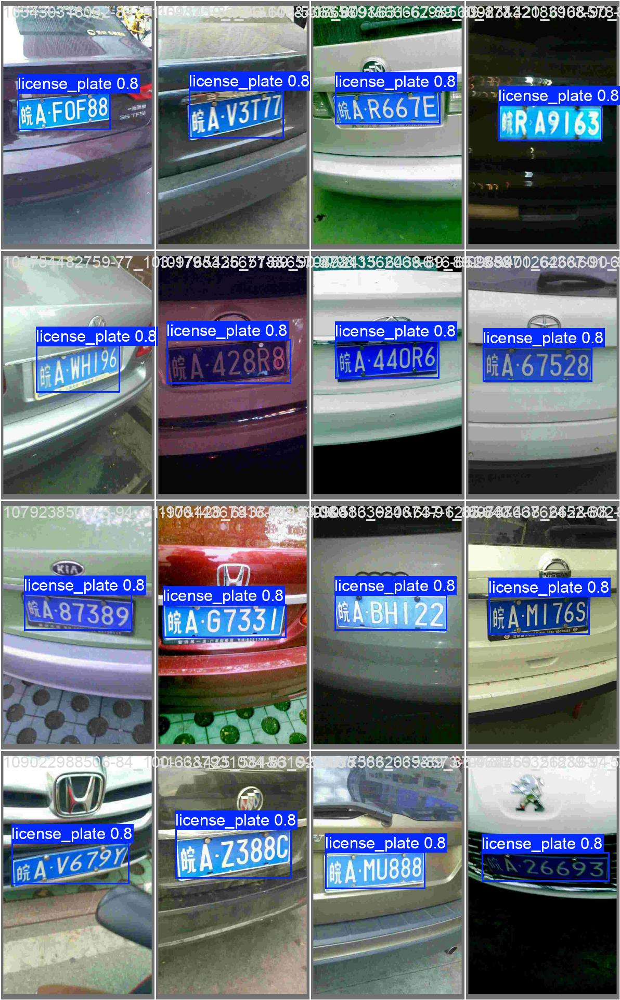
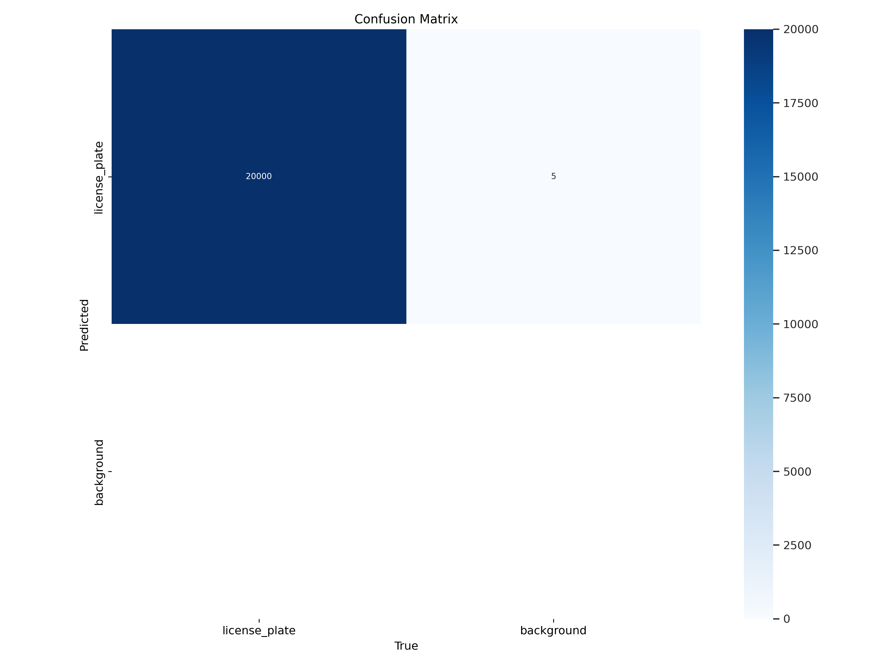
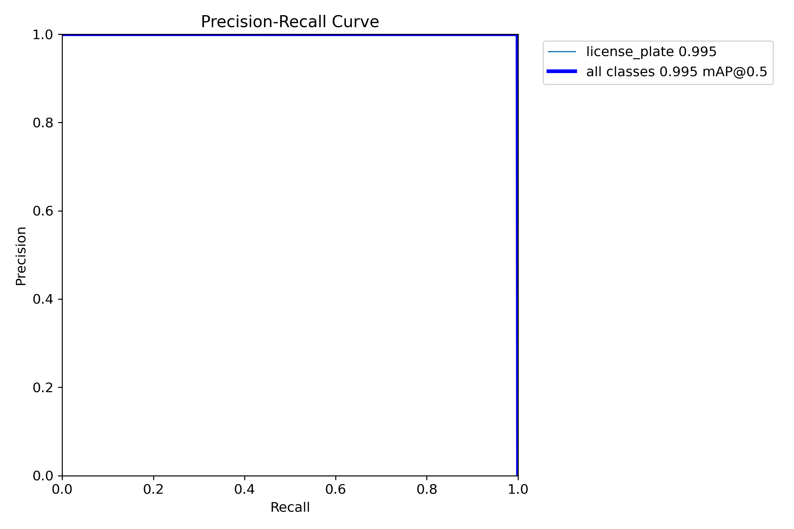
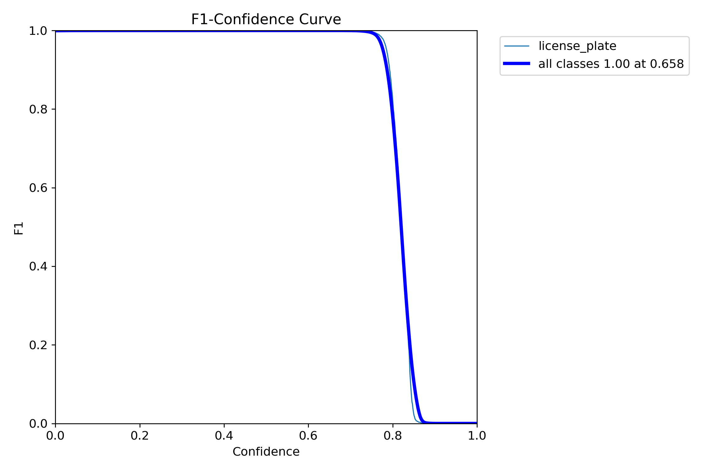
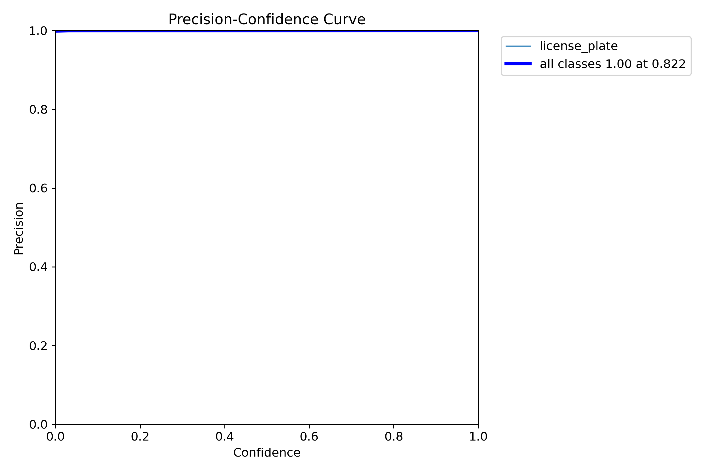
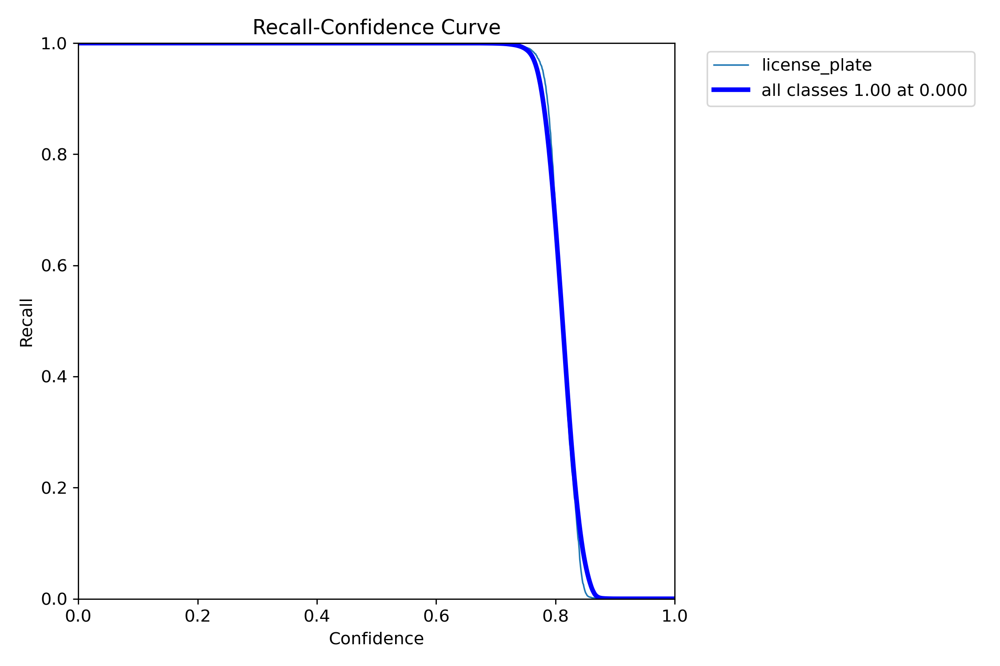
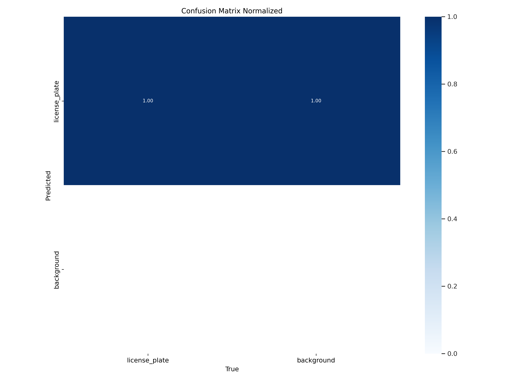
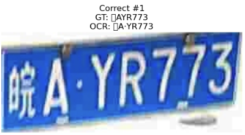
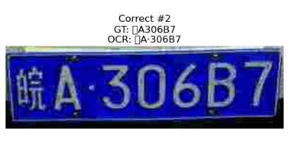
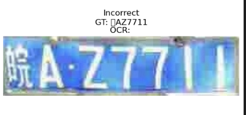

# 🏷️ CCPD License Plate Recognition (YOLO + PaddleOCR)

🚀 **An end-to-end system for license plate detection and recognition using YOLOv8 and PaddleOCR.**  
📌 **Achieved:**  
✅ **mAP@0.5: 99.5% (YOLO Detection Accuracy)**  
✅ **OCR Character Accuracy: 94.75%**  
✅ **Full Plate Recognition Accuracy: 93.26%**  

---

## 📌 Project Overview

| Task                     | Method Used  |
|--------------------------|-------------|
| **License Plate Detection** | YOLOv8 (Fine-tuned) |
| **License Plate Cropping** | Automated via bounding boxes |
| **OCR Recognition** | PaddleOCR (Optimized for Chinese plates) |
| **Accuracy Metrics** | mAP, Precision, Recall, Character Accuracy |
| **Dataset Used** | CCPD (or custom dataset) |

---

## 📂 Project Structure

| File/Folder                  | Description                                                               |
|------------------------------|---------------------------------------------------------------------------|
| `data/`                      | Contains training, validation, test sets, and cropped plate images        |
| ├─ `train/`, `val/`, `test/`| YOLO images & labels (CCPD or custom dataset)                              |
| ├─ `cropped_plates/`         | Cropped plate images after YOLO detection                                 |
| └─ `ground_truth.json`       | Mapping: `{ "cropped_img.jpg": "plate_text" }`                            |
| `visualisation`     | Evaluation  plots & sample detection/OCR images        |
| `src/`                   | Core scripts for YOLO training, detection, OCR, and evaluation            |
| ├─ `train_yolo.py`           | Train YOLO from scratch                                                   |
| ├─ `train_yolo_fine_tune.py` | Fine-tune YOLO on CCPD                                                     |
| ├─ `evaluate_yolo.py`        | Evaluate YOLO detection (mAP, precision, recall)                          |
| ├─ `detect_yolo.py`          | Run YOLO detection on new images                                          |
| ├─ `crop_plates.py`          | Crop detected plate regions                                               |
| ├─ `ocr_paddle.py`           | PaddleOCR text recognition on cropped plates                              |
| └─ `evaluate_ocr.py`         | Compare OCR results vs. ground truth (char-level & full-plate accuracy)   |
| `requirements.txt`           | Python dependencies                                                       |
| `README.md`                  | Project documentation (this file)                                         |

---
## 📊 YOLO Detection Results

🔥 **Example Detection:**  
  

🚀 **Confusion Matrix:**  
  

📈 **Precision-Recall Curve:**  
  

📉 **F1 Score Curve:**  
  

📌 **P-curve (Precision over training epochs)**  
  

📌 **R-curve (Recall over training epochs)**  
  

📌 **Normalized Confusion Matrix**  
  

---

## 🔠 OCR Performance & Evaluation

### ✅ OCR Recognition Examples

| **Original Image** | **OCR Result** | **Ground Truth** | **Correct?** |
|--------------------|---------------|------------------|--------------|
|  | 京A12345 | 京A12345 | ✅ |
|  | 沪B67990 | 沪B67890 | ❌ |
|  | 粤C88888 | 粤C88888 | ✅ |

🚀 **OCR Mistakes:**  
  

---

## 🔥 Key Takeaways

📌 **End-to-End Pipeline** – Detection (YOLO) + Recognition (PaddleOCR) in a single workflow.  
📌 **High Accuracy** – **mAP@0.5 = 99.5%**, OCR **Character-Level Accuracy = 94.75%**.  
📌 **Error Analysis & Improvements** – Understanding where OCR struggles.  

---

## 🌍 Real-World Applications

🚗 **Traffic monitoring & toll systems**  
🏢 **Smart parking & automated entry**  
🚓 **Law enforcement & stolen vehicle detection**  

---

## 🛠️ Future Enhancements

🔹 **Improve OCR Accuracy** – Fine-tune PaddleOCR or explore CRNN models.  
🔹 **Post-Processing Rules** – Enforce regex/whitelist filtering for valid plate formats.  
🔹 **Edge Deployment** – Optimize for **Raspberry Pi / Jetson Nano** for real-time use.  

---

## 📖 References

- **[Ultralytics YOLOv8 Docs](https://docs.ultralytics.com/)**
- **[PaddleOCR GitHub](https://github.com/PaddlePaddle/PaddleOCR)**
- **[CCPD Dataset](https://github.com/detectRecog/CCPD)**

